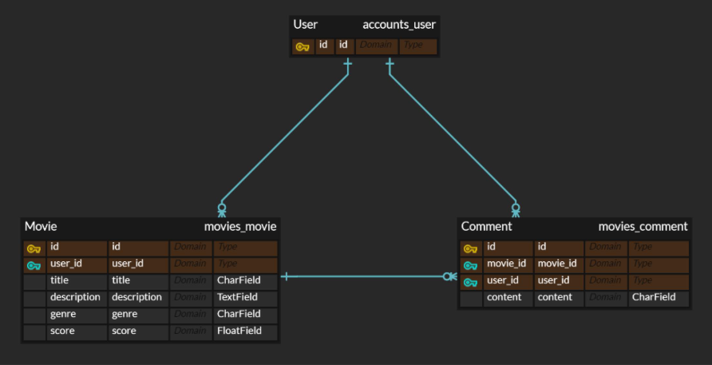

# Finance

### 학습한 내용
- selenium과 BeautifulSoup을 사용하여 웹 크롤링을 수행하는 방법
- Python에서의 파일 입출력과 문자열 처리 기술

### 어려웠던 부분
- 웹 크롤링과 데이터 시각화 부분
- selenium을 사용하여 동적 웹페이지에서 데이터를 추출하는 과정에서 웹 페이지 로딩 시간 조절과 정확한 HTML 요소 선택

### 해결 과정
- 웹 크롤링의 어려움을 극복하기 위해 selenium의 다양한 기능 연구
- CSS 선택자를 사용하여 원하는 HTML 요소를 정확하게 선택하는 방법 탐구

### 기억하면 좋을 것들
- selenium과 BeautifulSoup을 함께 사용하면 동적 웹 페이지에서도 데이터를 효과적으로 크롤링할 수 있다
- BeautifulSoup
  - HTML과 XML 파싱: BeautifulSoup은 HTML과 XML 파일을 파싱하여 데이터를 쉽게 추출할 수 있게 해줌
  - 복잡한 HTML 문서에서도 필요한 정보를 빠르게 찾을 수 있다
  - 태그 검색: 다양한 메서드를 제공하여 특정 태그나 태그의 집합을 쉽게 찾을 수 있다
    - `find()`: 문서에서 조건에 맞는 첫 번째 태그 검색 / 특정 태그 이름, 속성, 문자열 등의 조건을 사용
    - `find_all()`: 조건에 맞는 모든 태그를 리스트 형태로 반환 / find() 메서드와 유사한 조건 사용 가능
    - `select()`: CSS 선택자를 사용하여 문서 내의 요소 검색 / 클래스, 아이디, 속성 등의 복잡한 선택자 사용 가능
  - 문자열 필터링: 문자열이나 정규 표현식을 사용하여 특정 조건에 맞는 태그를 찾을 수 있다
    - `.get_text()`: 선택한 태그 내부의 모든 텍스트 추출 / 태그 자체는 제외하고 텍스트만 반환
    - `.attrs`: 태그의 속성을 딕셔너리 형태로 반환 / 태그의 class, id, href 등의 속성에 접근 가능
    - `.get()`: 태그의 특정 속성 값 반환 / 속성이 존재하지 않는 경우, 선택적으로 기본값 반환 가능

# Movie

### 학습한 내용
- Django Model과 ORM을 사용하여 데이터를 생성, 조회, 수정, 삭제할 수 있는 웹 어플리케이션 제작 방법
- Django Authentication System을 통한 사용자 인증 시스템 구축 방법
- Many to One 관계 설정 방법 및 이를 활용한 데이터 모델링
- MovieForm과 CommentForm을 사용하여 사용자 입력을 처리하고 유효성 검사를 수행하는 방법

### 어려웠던 부분
- ModelForm을 사용하여 Movie, Comment, User 모델의 데이터 검증 및 저장 과정에서 발생한 에러 메시지 관리
- Django의 Authentication System 로그인, 로그아웃, 회원가입 기능 구현
- Many to One 관계를 형성하는 과정에서 영화, 댓글, 회원 간의 모델 관계 설정

### 해결 과정
- 공식 Django 문서와 관련된 온라인 자료를 참조하여 ModelForm, Authentication System에 대한 이해 제고
- 실제 예제를 통해 Many to One 관계 설정을 연습함으로써 관계 설정에 대한 이해 제고

### 기억하면 좋을 것들
- 프로젝트 구현 과정에서 발생할 수 있는 다양한 문제에 대비하기 위해 Django 공식 문서를 숙지하는 것은 중요하다
