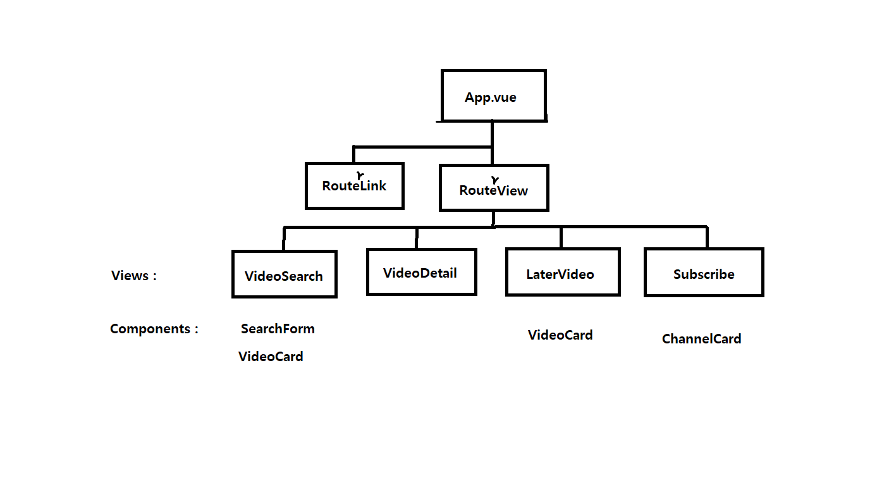

# 0. vue3에서 API key 관리하기
1. `.env` file
```
VITE_API_KEY='###'
```

2. 사용 예시
```js
key: import.meta.env.VITE_API_KEY
// import.meta.env + {{ 변수명 }} 로 사용
// vue 전역에서 사용 가능
```

3. `.gitignore`에 `.env` 등록

<br>

---
### 프로젝트 구조

---

<br>

# 1. 동영상 검색 결과 출력

### Search form
```html
<form class="input-group mb-3">
  <input v-model="inputData" type="text" class="form-control" placeholder="검색어를 입력하세요" id="search">
  <button type="submit" class="btn btn-success" @click.prevent="store.importVideos(inputData)">찾기</button>
</form>
```
```js
const inputData = ref('')
```
- form 태그를 사용하여 input과 button 관리한다.
- input 태그에는 v-model로 `inputData`와 양방향 바인딩하여 값을 저장한다.
- button 태그에는 `@click.prevent`로 submit 이벤트를 취소시한다.
- `store.importVideos()` 함수에 `inputData` 인자를 넣어 검색한다.

### importVideos()
```js
  const importVideos = function (inputData) {
    videos.value = []

    axios({
      method: 'get',
      url: 'https://www.googleapis.com/youtube/v3/search',
      params: {
        key: import.meta.env.VITE_API_KEY,
        part: 'snippet',
        type: 'videos',
        q: inputData,
        maxResults: 50,
        type: 'video',
      }
    })
    .then(res => {
      videos.value.push(...res.data.items)
    })
    .catch(err => console.error(err))
  }
  ```

### 요청 받은 데이터는 v-for로 출력한다.

<br>

# 2. 동영상 상세 정보 출력
```html
<RouterLink :to="{ name: 'detail', params: {'id':video.etag} }" class="button">
  <VideoCard :video="video" />
</RouterLink>
```
- params에 `video.etag`를 담아서 보낸다.
```js
// VideoDetailView.vue

const video = ref(store.videos.find((video => video.etag == etag.value)))
```
- 받은 params를 활용하여 find로 detail page에 표시할 대상 video를 찾는다.

```js
// VideoDetailView.vue

onMounted (() => {
  axios({
    method: 'get',
    url: 'https://www.googleapis.com/youtube/v3/videos',
    params: {
      key: import.meta.env.VITE_API_KEY,
      part: 'snippet',
      id: video.value.id.videoId,
    }
  }).then(res => {
    description.value = res.data.items[0].snippet.description
  }).catch(error => {
    console.error(error)
  })
})
```
- detail page로 바로 접속 할 경우 axios에 요청이 들어가지 않으므로 detail page가 onMount될 때 따로 axios에 요청을 해준다.

#### 동영상 저장
```js
const isSaved = function(id) {
  if (store.laters.find(video => video.id.videoId === id)) {
    return true
  } else {
    return false
  }
}
```
- local store(`counter.js`)에 `const laters = ref([])`라는 array를 선언하여 나중에 볼 동영상을 저장한다.
- `v-if="isSaved"`를 활용하여 저장이 되어 있으면 '저장 취소' 버튼을, 저장되지 않은 동영상이면 '동영상 저장' 버튼을 출력한다.

```html
<iframe
  :src=videoUrl
  :title="video.snippet.title"
  frameborder="0"
  allow="accelerometer; autoplay; clipboard-write; encrypted-media; gyroscope; picture-in-picture; web-share"
  referrerpolicy="strict-origin-when-cross-origin"
  allowfullscreen
></iframe>
```
- `iframe`태그를 활용하여 page에 youtube 동영상을 재생한다.

<br>

# 3. 나중에 볼 동영상 저장 및 삭제
- `store.laters`에 저장된 데이터를 사용한다.
#### 저장
```js
  const addLaters = function(video) {
    laters.value.push(video)
  }
```

#### 삭제
```js
  const deleteLaters = function(id) {
    const idx = laters.value.findIndex(video => video.id.videoId === id)
    laters.value.splice(idx, 1)
  }
```
- `findIndex`를 사용하여 삭제하고자 하는 동영상의 인덱스를 `idx`라는 변수에 할당해준다.
- `findIndex` : 인자로 받은 id와 videoId가 일치하는 video 객체의 인덱스 반환
- `splice(idx, 1)` : `{{ idx }}` 번째의 대상을 `{{ 1 }}`개 삭제

<br>

# 4. 내가 좋아하는 채널 저장 및 삭제
- `store` >> `const channels = ref([])` 에 채널명을 저장 한다.
- `channelTitle`라는 응답 속성을 활용하여 `chnnels`에 title을 저장 및 삭제해준다.
```js
  const addChannel = function(channelTitle) {
    channels.value.push(channelTitle)
    console.log('saved')
  }

  const deleteChannel = function(channelTitle) {
    const title = channels.value.findIndex(channel => channel === channelTitle)
    channels.value.splice(title, 1)
  }
```